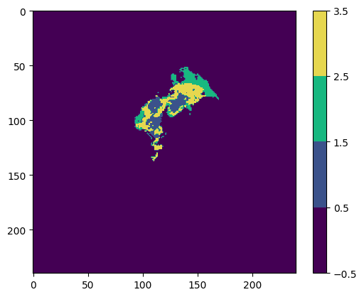

# Brain Tumor Segmentation using U-Net

A deep learning project for automated brain tumor segmentation from multimodal MRI scans using the U-Net architecture. This project implements a 2D U-Net model trained on the BraTS2020 dataset to segment brain tumors into different regions: necrotic core, edema, and enhancing tumor.


## 📋 Table of Contents

- [Overview](#overview)
- [Features](#features)
- [Dataset](#dataset)
- [Model Architecture](#model-architecture)
- [Installation](#installation)
- [Usage](#usage)
- [Results](#results)
- [Project Structure](#project-structure)
- [Technologies Used](#technologies-used)
- [License](#license)

## 🎯 Overview

This project implements a U-Net based convolutional neural network for semantic segmentation of brain tumors from multimodal MRI scans. The model processes T1CE (Post-contrast T1-weighted) and FLAIR (T2-Fluid Attenuated Inversion Recovery) MRI modalities to accurately identify and segment different tumor regions.

### Key Highlights

- **Multimodal MRI Processing**: Utilizes T1CE and FLAIR modalities for comprehensive tumor analysis
- **4-Class Segmentation**: Segments tumors into background, necrotic core, edema, and enhancing tumor
- **High Performance**: Achieves >99% accuracy and precision on test data
- **Medical Imaging Format**: Handles NIfTI (.nii) format commonly used in neuroimaging

## ✨ Features

- Automated brain tumor segmentation from MRI scans
- Support for multimodal MRI data (T1CE and FLAIR)
- One-hot encoded segmentation masks
- Comprehensive evaluation metrics (Dice coefficient, IoU, Precision, Sensitivity, Specificity)
- Per-class performance analysis
- Model checkpointing and best model saving
- Training history visualization

## 📊 Dataset

The project uses the **BraTS2020 (Brain Tumor Segmentation) dataset**, which contains:

- **369 training samples** (patients with glioma)
- **4 MRI modalities** per patient:
  - Native (T1)
  - Post-contrast T1-weighted (T1ce)
  - T2-weighted (T2)
  - T2-FLAIR
- **Expert-annotated segmentation masks** with 4 classes:
  - **Class 0**: Not Tumor (background)
  - **Class 1**: Necrotic and non-enhancing tumor core (NCR/NET)
  - **Class 2**: Peritumoral edema (ED)
  - **Class 3**: GD-enhancing tumor (ET) - originally labeled as 4


### Data Distribution

The dataset is split into:
- **Training Set**: 68% (39 patients)
- **Validation Set**: 20% (12 patients)
- **Test Set**: 12% (8 patients)


### Image Format

- **Format**: NIfTI (.nii) - Neuroimaging Informatics Technology Initiative
- **Dimensions**: 240 × 240 × 155 (3D volumes)
- **Preprocessing**: 
  - Slices resized to 128 × 128
  - Normalized using MinMaxScaler
  - Slices 22-122 selected for training (100 slices per volume)


## 🏗️ Model Architecture

### U-Net

The project implements a **2D U-Net** architecture, specifically designed for biomedical image segmentation. U-Net consists of:

- **Encoder (Contracting Path)**: 
  - 4 downsampling blocks with max pooling
  - Feature extraction through convolutional layers
  - Channels: 32 → 64 → 128 → 256 → 512

- **Decoder (Expanding Path)**:
  - 4 upsampling blocks with transpose convolutions
  - Skip connections from encoder
  - Feature reconstruction to original resolution

- **Output Layer**: 
  - 4-channel output (one-hot encoded classes)
  - Softmax activation for probability distribution

**Model Parameters**: ~7.76 million trainable parameters

### Architecture Details

```
Input: (2, 128, 128) - [FLAIR, T1CE channels]
  ↓
Encoder Blocks (4 levels)
  ↓
Bottleneck (512 channels)
  ↓
Decoder Blocks (4 levels with skip connections)
  ↓
Output: (4, 128, 128) - [Background, Necrotic, Edema, Enhancing]
```



## 🚀 Installation

### Prerequisites

- Python 3.7+
- CUDA-capable GPU (recommended for training)
- 8GB+ RAM
- 10GB+ free disk space

### Setup

1. **Clone the repository**:
```bash
git clone <repository-url>
cd "Brain Tumor Segmentation"
```

2. **Install required packages**:
```bash
pip install torch torchvision
pip install nibabel
pip install opencv-python
pip install scikit-image
pip install scikit-learn
pip install matplotlib
pip install pandas
pip install kaggle
```

3. **Download the dataset**:
   - The dataset can be downloaded from [Kaggle: BraTS2020 Dataset](https://www.kaggle.com/datasets/awsaf49/brats20-dataset-training-validation)
   - Place the dataset in the appropriate directory as specified in the notebook

## 💻 Usage

### Training the Model

1. Open the Jupyter notebook: `brain-tumor-segmentation-using-u-net.ipynb`

2. Run all cells sequentially to:
   - Download and preprocess the dataset
   - Split data into train/validation/test sets
   - Initialize the U-Net model
   - Train the model
   - Evaluate performance

3. Training parameters can be adjusted:
   - `VOLUME_SLICES`: Number of slices per volume (default: 100)
   - `IMG_SIZE`: Image dimensions (default: 128)
   - `batch_size`: Batch size (default: 8)
   - `num_epochs`: Number of training epochs (default: 10)
   - `learning_rate`: Initial learning rate (default: 0.001)

### Making Predictions

Use the `predictByPath()` or `showPredictsById()` functions to generate segmentations:

```python
# Predict on a test case
predictions = predictByPath(case_path, case_id, model, device)

# Visualize predictions
showPredictsById(case='001', model=model, device=device)
```

### Loading a Trained Model

```python
# Load best model
checkpoint = torch.load('Model/best_model.pth', map_location=device)
model.load_state_dict(checkpoint['model_state_dict'])
model.eval()
```

## 📈 Results

### Model Performance

The trained model achieves the following performance metrics on the test set:

| Metric | Value |
|--------|-------|
| **Overall Dice Coefficient** | 0.4634 |
| **Precision** | 0.9935 |
| **Sensitivity (Recall)** | 0.9930 |
| **Specificity** | 0.9978 |

### Per-Class Dice Coefficients

| Class | Dice Coefficient |
|-------|------------------|
| **Necrotic Core** | 0.1783 |
| **Edema** | 0.3882 |
| **Enhancing Tumor** | 0.3572 |


### Training History

The model shows consistent improvement during training:
- Training and validation loss decrease steadily
- Dice coefficient increases over epochs
- No significant overfitting observed
- Best model saved at epoch with lowest validation loss

### Sample Predictions


The model successfully identifies and segments:
- Tumor boundaries
- Different tumor sub-regions (necrotic, edema, enhancing)
- Spatial relationships between tumor components

## 📁 Project Structure

```
Brain Tumor Segmentation/
│
├── brain-tumor-segmentation-using-u-net.ipynb  # Main notebook
├── README.md                                    # This file
│
├── Images/                                      # Visualization images
│   ├── all modalities.png
│   ├── data distribution.png
│   ├── Model Performance.png
│   ├── Model Prediction.png
│   ├── segmentation.png
│   ├── transverse view.png
│   └── tumor segmentation.png
│
└── Model/                                       # Saved models
    ├── best_model.pth                          # Best model checkpoint
    └── final_model.pth                         # Final epoch model
```

## 🛠️ Technologies Used

- **PyTorch**: Deep learning framework
- **Nibabel**: NIfTI file handling
- **OpenCV**: Image processing and resizing
- **scikit-image**: Image manipulation utilities
- **scikit-learn**: Data preprocessing and splitting
- **Matplotlib**: Visualization
- **NumPy**: Numerical computations
- **Pandas**: Data handling

## 📝 Key Implementation Details

### Data Preprocessing

1. **Slice Selection**: Uses slices 22-122 (100 slices) to focus on informative brain regions
2. **Resizing**: Reduces image size from 240×240 to 128×128 for computational efficiency
3. **Normalization**: MinMaxScaler normalization (0-1 range)
4. **One-Hot Encoding**: Converts segmentation masks to one-hot format for multi-class classification

### Loss Function

- **Categorical Cross-Entropy**: Primary loss function for multi-class segmentation
- **Dice Loss**: Alternative loss function focusing on overlap between predictions and ground truth

### Evaluation Metrics

- **Dice Coefficient**: Measures overlap between predicted and ground truth segmentations
- **IoU (Intersection over Union)**: Spatial overlap metric
- **Precision**: Proportion of predicted positives that are actually positive
- **Sensitivity (Recall)**: Proportion of actual positives correctly identified
- **Specificity**: Proportion of actual negatives correctly identified

### Training Strategy

- **Optimizer**: Adam optimizer with initial learning rate 0.001
- **Learning Rate Scheduling**: ReduceLROnPlateau (reduces LR when validation loss plateaus)
- **Early Stopping**: Model checkpointing saves best model based on validation loss
- **Data Augmentation**: Shuffling during training for better generalization

## 🔬 Medical Imaging Context

### MRI Modalities Explained

- **T1 (Native)**: Shows brain anatomy and structure
- **T1CE (Post-contrast T1)**: Enhanced visibility of abnormalities with contrast agent
- **T2**: Highlights fluid content in brain tissues
- **FLAIR**: Suppresses fluid signals to better detect lesions in white matter

### Segmentation Classes

1. **Background (Class 0)**: Normal brain tissue
2. **Necrotic Core (Class 1)**: Dead or non-enhancing tumor tissue
3. **Edema (Class 2)**: Swelling around the tumor
4. **Enhancing Tumor (Class 3)**: Active, contrast-enhancing tumor region

## 🎓 Future Improvements

- Experiment with 3D U-Net for better spatial context
- Implement data augmentation techniques
- Try different architectures (Attention U-Net, ResUNet)
- Fine-tune hyperparameters for better performance
- Ensemble multiple models
- Implement post-processing techniques

## 📄 License

This project uses the BraTS2020 dataset, which is licensed under **CC0-1.0** (Public Domain). Please refer to the dataset license for usage terms.

## 🙏 Acknowledgments

- **BraTS2020 Challenge**: For providing the dataset
- **U-Net Paper Authors**: Olaf Ronneberger, Philipp Fischer, and Thomas Brox
- **Kaggle Community**: For dataset hosting and resources

## 📧 Contact

For questions, suggestions, or collaborations, please open an issue or contact the repository maintainer.

---

**Note**: This project is for educational and research purposes. For clinical applications, ensure proper validation and regulatory compliance.

